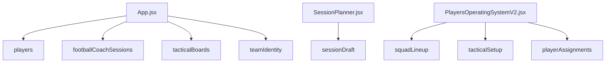

# Data and Storage

Coach Command Centre is currently a frontend-only localStorage MVP. There is no backend, database, login, cloud sync, or API layer.

## Storage Helper

`src/utils/storage.js` owns the localStorage wrapper.

```js
const appPrefix = 'footballCoachCommandCentre'
```

Every saved key is stored as:

```text
footballCoachCommandCentre:<key>
```

| Function | Purpose |
| --- | --- |
| `getStorageItem(key, fallbackValue)` | Reads JSON from localStorage and returns fallback when missing or invalid. |
| `setStorageItem(key, value)` | Serializes data as JSON and writes it to localStorage. |
| `removeStorageItem(key)` | Removes a prefixed localStorage item. |

## Exact localStorage Keys

| Logical key | Actual browser key | Owner / usage |
| --- | --- | --- |
| `players` | `footballCoachCommandCentre:players` | Main player records used by Dashboard, Players OS, Session Planner context, and onboarding imports. |
| `footballCoachSessions` | `footballCoachCommandCentre:footballCoachSessions` | Saved session records used by Dashboard and Session Planner. |
| `tacticalBoards` | `footballCoachCommandCentre:tacticalBoards` | Saved tactical board records used by Dashboard and Tactical Board. |
| `teamIdentity` | `footballCoachCommandCentre:teamIdentity` | Team identity, colours, crest, coach profile, season metadata, and setup status. |
| `sessionDraft` | `footballCoachCommandCentre:sessionDraft` | Autosaved unsaved Session Planner workspace state. |
| `squadLineup` | `footballCoachCommandCentre:squadLineup` | Players OS lineup state. |
| `tacticalSetup` | `footballCoachCommandCentre:tacticalSetup` | Players OS team tactic setup state. |
| `playerAssignments` | `footballCoachCommandCentre:playerAssignments` | Players OS captain/set-piece/role assignment state. |
| `coachCommandCentre:onboardingComplete` | `footballCoachCommandCentre:coachCommandCentre:onboardingComplete` | Onboarding completion marker written by `App.jsx`. |

## Data Ownership



## Player Data

Player records support fields such as:

- `id`
- `fullName`
- `shirtNumber`
- `age`
- `mainPosition`
- `secondaryPosition`
- `preferredFoot`
- `status`
- `developmentFocus`
- `technicalRating`
- `physicalRating`
- `tacticalRating`
- `mentalRating`
- `strengths`
- `areasToImprove`
- `coachNotes`
- `avatarDataUrl`
- `notes`
- `createdAt`
- `updatedAt`

Player images are stored as data URLs inside player records.

## Session Data

Session records support fields such as:

- `id`
- `sessionTitle`
- `date`
- `ageGroup`
- `duration`
- `numberOfPlayers`
- `abilityLevel`
- `pitchSize`
- `equipmentAvailable`
- `status`
- `mainGameMoment`
- `primaryTopic`
- `topicTags`
- `sessionType`
- `coachingStyle`
- `activities`
- `createdAt`
- `updatedAt`

Activities can include embedded diagrams. These diagrams are normalized through `DiagramPreview.jsx` and can be copied into Tactical Board.

## Tactical Board Data

Board records support fields such as:

- `id`
- `title`
- `boardType`
- `pitchLayout`
- `notes`
- `objects`
- `createdAt`
- `updatedAt`

Board objects include home/away/neutral players, balls, cones, mini goals, arrows, lines, and areas/zones.

## Team Identity Data

Team identity includes team and coach metadata, colours, crest, goals, season information, and `setupCompleted`. `teamIdentity.js` normalizes data, validates crest files, derives CSS variables, and applies theme values to `document.documentElement`.

Team crests and coach photos are stored as data URL objects inside saved identity records.

## Data Protection Rules

- Do not rename localStorage keys without a migration plan.
- Do not clear localStorage.
- Do not overwrite saved records with incomplete defaults.
- Keep new fields optional and backward compatible.
- Preserve session draft recovery.
- Preserve player avatars, coach photos, team crests, and diagrams.
- If a future backend is added, document migration from these localStorage keys first.
