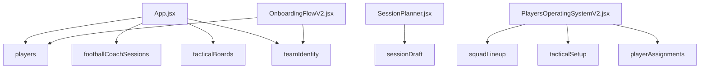

# Data and Storage

Coach Command Centre is currently a frontend-only localStorage MVP. There is no backend, database, login, cloud sync, or API layer.

## localStorage Prefix

`src/utils/storage.js` owns the localStorage wrapper.

```js
const appPrefix = 'footballCoachCommandCentre'
```

Every saved key is stored as:

```text
footballCoachCommandCentre:<key>
```

## Storage Helper Functions

| Function | Purpose |
| --- | --- |
| `getStorageItem(key, fallbackValue)` | Reads JSON from localStorage and returns fallback when missing or invalid. |
| `setStorageItem(key, value)` | Serializes data as JSON and writes it to localStorage. |
| `removeStorageItem(key)` | Removes a prefixed localStorage item. |

## Exact localStorage Keys

| Logical key | Actual browser key | Owner / usage |
| --- | --- | --- |
| `players` | `footballCoachCommandCentre:players` | Player records used by Dashboard, Players OS, Session Planner context, and onboarding import. |
| `footballCoachSessions` | `footballCoachCommandCentre:footballCoachSessions` | Saved session records used by Dashboard and Session Planner. |
| `tacticalBoards` | `footballCoachCommandCentre:tacticalBoards` | Saved tactical board records used by Dashboard and Tactical Board. |
| `teamIdentity` | `footballCoachCommandCentre:teamIdentity` | Team identity, colours, crest, coach profile, season metadata, and setup status. |
| `sessionDraft` | `footballCoachCommandCentre:sessionDraft` | Autosaved unsaved Session Planner workspace state. |
| `squadLineup` | `footballCoachCommandCentre:squadLineup` | Players OS lineup state. |
| `tacticalSetup` | `footballCoachCommandCentre:tacticalSetup` | Players OS team tactic setup state. |
| `playerAssignments` | `footballCoachCommandCentre:playerAssignments` | Players OS captain/set-piece/role assignment state. |
| `coachCommandCentre:onboardingComplete` | `footballCoachCommandCentre:coachCommandCentre:onboardingComplete` | Onboarding completion marker written by `App.jsx`. |

## Data Ownership Diagram



## Data Shape Overview

### Players

Player records generally include:

- identity: `id`, `fullName`, `shirtNumber`, `age`
- position: `mainPosition`, `secondaryPosition`, `preferredFoot`
- coaching: `status`, `developmentFocus`, `strengths`, `areasToImprove`, `coachNotes`, `notes`
- ratings: `technicalRating`, `physicalRating`, `tacticalRating`, `mentalRating`
- media: `avatarDataUrl`
- metadata: `createdAt`, `updatedAt`

### Sessions

Session records generally include:

- identity: `id`, `sessionTitle`, `date`, `status`
- setup: `ageGroup`, `duration`, `numberOfPlayers`, `abilityLevel`, `pitchSize`, `equipmentAvailable`
- focus: `mainGameMoment`, `primaryTopic`, `topicTags`, `sessionType`, `coachingStyle`
- design: `activities`
- metadata: `createdAt`, `updatedAt`

Activities can include setup, rules, coaching points, player questions, progression, regression, coach notes, diagram notes, and embedded diagrams.

### Tactical Boards

Board records generally include:

- `id`
- `title`
- `boardType`
- `pitchLayout`
- `notes`
- `objects`
- `createdAt`
- `updatedAt`

Objects can include home players, away players, neutral players, balls, cones, mini goals, arrows, lines, and areas/zones.

### Team Identity

Team identity records include team, coach, theme, season, crest, and setup fields. `teamIdentity.js` normalizes the identity, validates crest objects, generates CSS variables, and applies theme values.

## Avatar / Crest / Photo Storage

- Team crests are stored as data object/data URL records inside `teamIdentity`.
- Coach photos are stored as data object/data URL records inside `teamIdentity` after onboarding.
- Player avatars are stored as data URLs inside player records.
- These records can become large; future cloud migration should move images to storage buckets.

## Draft Protection

`sessionDraft` protects unsaved Session Planner work. It stores the current form data, selected session id, saved snapshot, and last autosave information.

Rules:

- Do not delete `sessionDraft` casually.
- Do not break draft restoration.
- If changing Session Planner data shape, maintain draft compatibility.

## Data Protection Rules

- Do not rename localStorage keys without migration.
- Do not clear localStorage.
- Do not overwrite saved records with incomplete defaults.
- Keep new fields optional and backward compatible.
- Preserve player avatars, coach photos, team crests, diagrams, saved boards, lineup, tactics, assignments, and session drafts.
- Test refresh persistence after any data-related change.

## Future Supabase / Firebase Migration Suggestions

Before migration:

1. Freeze current localStorage data shape documentation.
2. Add local export/import backup.
3. Define database tables for teams, players, sessions, session activities, tactical boards, board objects, lineups, tactics, assignments, and feedback.
4. Decide whether a coach account owns one team, multiple teams, or multiple season workspaces.
5. Move data URL images to cloud storage with references.
6. Create a migration path from browser-local records.
7. Keep local fallback or import support for existing users.

Never assume browser-local data can be discarded.
