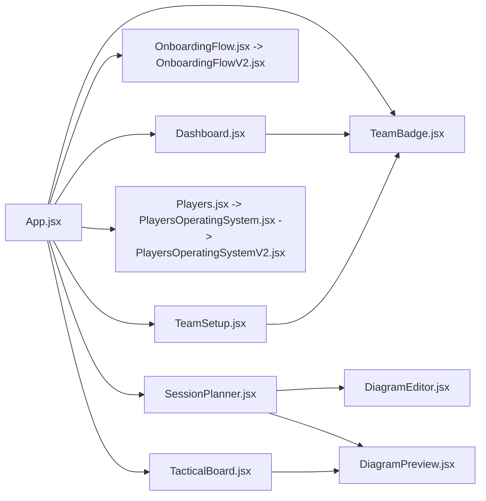

# Module Guide

This guide describes the current app modules and how they connect through `src/App.jsx`.

## Page Routing From App.jsx

`App.jsx` uses local React state instead of React Router.

| Page id | Label | Rendered component | Status |
| --- | --- | --- | --- |
| `dashboard` | Home | `Dashboard` | Implemented |
| `players` | Players | `Players` -> `PlayersOperatingSystem` -> `PlayersOperatingSystemV2` | Implemented |
| `sessions` | Session Planner | `SessionPlanner` | Implemented |
| `tactics` | Tactical Board | `TacticalBoard` | Implemented |
| `clubSetup` | Club Setup / Settings | `TeamSetup` | Implemented |
| `matchCentre` | Match Centre | Disabled future nav item | Future shell |
| `calendar` | Calendar | Disabled future nav item | Future shell |
| `reports` | Reports | Disabled future nav item | Future shell |

If `teamIdentity.setupCompleted` is false, `App.jsx` renders `OnboardingFlow` instead of the main app shell.

## Component Relationship

## File / Function Table

| File | Function | Status |
| --- | --- | --- |
| `src/App.jsx` | App shell, navigation, state ownership, storage writes, onboarding gate, cross-module callbacks. | Implemented |
| `src/main.jsx` | React entry point and CSS import order. | Implemented |
| `src/pages/Dashboard.jsx` | Coach HQ dashboard using players, sessions, boards, and team identity. | Implemented |
| `src/pages/OnboardingFlow.jsx` | Re-export wrapper to v2 onboarding. | Implemented wrapper |
| `src/pages/OnboardingFlowV2.jsx` | First-run coach/team/squad/season/direction onboarding. | Implemented |
| `src/pages/TeamSetup.jsx` | Club setup and team identity settings wizard. | Implemented |
| `src/pages/Players.jsx` | Re-export wrapper to Players OS. | Implemented wrapper |
| `src/pages/PlayersOperatingSystem.jsx` | Re-export wrapper to v2 Players OS. | Implemented wrapper |
| `src/pages/PlayersOperatingSystemV2.jsx` | Player Centre, Squad Management, lineup, tactics, assignments, profile modals, notes, avatars. | Implemented |
| `src/pages/SessionPlanner.jsx` | Session Studio dashboard, workspace, autosave, activities, diagrams, saved sessions. | Implemented |
| `src/pages/TacticalBoard.jsx` | Tactical workstation with saved boards, pitch objects, drawing tools, inspector, presentation mode. | Implemented |
| `src/components/DiagramEditor.jsx` | Diagram editing surface used by session activities. | Implemented |
| `src/components/DiagramPreview.jsx` | Diagram normalization, pitch layouts, diagram object rendering. | Implemented |
| `src/components/TeamBadge.jsx` | Team crest/initials rendering across shell, dashboard, and setup. | Implemented |
| `src/utils/storage.js` | localStorage get/set/remove helpers with app prefix. | Implemented |
| `src/utils/teamIdentity.js` | Team identity normalization, theme variables, crest validation, theme application. | Implemented |

## Implemented Modules

### Dashboard / Home

Uses real app data to show coach HQ status: player count, sessions, upcoming sessions, tactical board count, team identity, quick actions, this week panel, next match preview, and latest tactical board.

### Players OS

Contains three major sections:

- Player Centre: searchable/filterable player list, selected player detail, action menu, profile modal, notes, avatars, ratings, development focus.
- Squad Management: lineup, tactics, assignments, player picker, bench management, formation preview.
- Development Plans: polished future area, not a full workflow yet.

### Session Planner

Contains:

- Studio dashboard.
- Create session route modal.
- Workspace header and quality checklist.
- Session basics, focus, and activity editor tabs.
- Activity diagrams with `DiagramEditor` and `DiagramPreview`.
- Autosaved session draft.
- Saved session create/update/delete/duplicate flows.
- Copy activity diagram to Tactical Board.

### Tactical Board

Contains:

- Saved board list.
- Board title/type/layout controls.
- Full SVG pitch workstation.
- Home/away/neutral players, ball, cone, mini goal, arrow, line, area/zone objects.
- Drag, resize, rotate, duplicate, delete, line handle controls.
- Board notes.
- Presentation mode.

### Team Setup / Onboarding

Onboarding handles first-run setup. Team Setup handles later updates. Both are tied to team identity, colours, crest, coach profile, season direction, and theme behavior.

## Partial / Preview Modules

| Area | Current behavior | Next step |
| --- | --- | --- |
| Dashboard Match Centre preview | Shows next fixture / opponent placeholder. | Build real Match Centre records. |
| Dashboard Club Announcements | Static announcement cards. | Add announcement data model or remove until needed. |
| Dashboard Player Progress | Preview metric and simple player spotlight. | Connect to real development tracking. |
| Players Development Plans | Coming-soon section. | Add individual development plans and timelines. |
| Session Planner AI assistant | Disabled shell. | Wait for backend/API infrastructure. |

## Future Shells

- Match Centre: fixtures, opponent, lineup, match notes, reflection, next training focus.
- Calendar: coaching schedule view.
- Reports: player/session/match summaries and export-ready reports.
