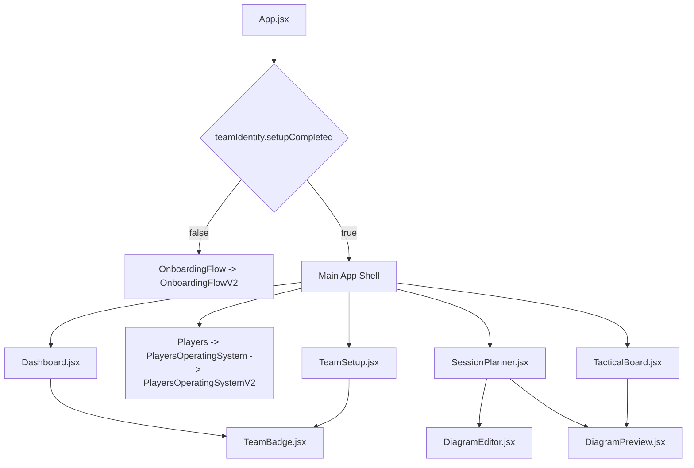

# Module Guide

This guide documents the real current modules in the latest remote `main` branch. Do not describe Players, Session Planner, or Tactical Board as placeholders; they are implemented / substantial modules.

## Page Routing From App.jsx

`App.jsx` uses local React state for page switching.

| Page id | Label | Rendered component | Status |
| --- | --- | --- | --- |
| `dashboard` | Home | `Dashboard` | Implemented / substantial |
| `players` | Players | `Players` -> `PlayersOperatingSystem` -> `PlayersOperatingSystemV2` | Implemented / substantial |
| `sessions` | Session Planner | `SessionPlanner` | Implemented / substantial |
| `tactics` | Tactical Board | `TacticalBoard` | Implemented / substantial |
| `clubSetup` | Club Setup / Settings | `TeamSetup` | Implemented / substantial |
| `matchCentre` | Match Centre | Disabled future nav item | Future shell |
| `calendar` | Calendar | Disabled future nav item | Future shell |
| `reports` | Reports | Disabled future nav item | Future shell |

If `teamIdentity.setupCompleted` is false, `App.jsx` renders `OnboardingFlow` instead of the main app shell.

## Component Hierarchy

## Module Details

### Dashboard / Home

| Field | Detail |
| --- | --- |
| File path | `src/pages/Dashboard.jsx` |
| Status | Implemented / substantial |
| Main functions | Coach HQ summary, player/session/tactical board stats, upcoming sessions, quick actions, team identity, this week panel, next match preview, tactical board preview. |
| Depends on data | `players`, `footballCoachSessions`, `tacticalBoards`, `teamIdentity`. |
| Current issues | Needs transformation into clearer Coach Mission Control; some sections are previews/static, including Match Centre preview, Club Announcements, and Player Progress. |
| Next suggestions | Make next action, weekly priorities, player attention, next session, and next match context more actionable. |

### Onboarding / Team Setup

| Field | Detail |
| --- | --- |
| File paths | `src/pages/OnboardingFlow.jsx`, `src/pages/OnboardingFlowV2.jsx`, `src/pages/TeamSetup.jsx` |
| Status | Implemented / substantial |
| Main functions | First-run onboarding, coach profile, team identity, squad setup, season setup, coaching direction, review/launch, club colours, crest upload, settings update. |
| Depends on data | `teamIdentity`, `players`, `coachCommandCentre:onboardingComplete`. |
| Current issues | Explore Demo remains a future modal; onboarding should continue to be reviewed for desktop and responsive proportions. |
| Next suggestions | Keep take-charge flow polished and ensure imports, image upload, and theme preview stay trustworthy. |

### Players OS

| Field | Detail |
| --- | --- |
| File paths | `src/pages/Players.jsx`, `src/pages/PlayersOperatingSystem.jsx`, `src/pages/PlayersOperatingSystemV2.jsx` |
| Status | Implemented / substantial |
| Main functions | Player Centre, search/filter, selected player command panel, player profiles, add/edit/delete, notes, avatars, ratings, development focus, Squad Management, Lineup, Tactics, Assignments. |
| Depends on data | `players`, `squadLineup`, `tacticalSetup`, `playerAssignments`. |
| Current issues | Development Plans is future/coming soon; lineup is click-to-pick rather than drag-and-drop; no automated tests cover full flow. |
| Next suggestions | Polish club theme integration, deepen player development timelines, build Development Plans, improve player review states. |

### Session Planner

| Field | Detail |
| --- | --- |
| File path | `src/pages/SessionPlanner.jsx` |
| Status | Implemented / substantial |
| Main functions | Session Studio dashboard, create session route modal, saved sessions, draft autosave, workspace tabs, session basics, training focus, activity editor, diagrams, quality checklist, copy diagram to Tactical Board. |
| Depends on data | `footballCoachSessions`, `sessionDraft`, `players`, `teamIdentity`, tactical board callback. |
| Current issues | AI assistant is future shell; Create Session Wizard can be refined; full PDF output is not implemented. |
| Next suggestions | Redesign toward stronger Session Design Studio, add session review/reflection, improve create wizard, prepare PDF/export output. |

### Tactical Board

| Field | Detail |
| --- | --- |
| File path | `src/pages/TacticalBoard.jsx` |
| Status | Implemented / substantial |
| Main functions | Saved board library, board metadata, pitch layouts, draggable home/away/neutral players, ball, cone, mini goal, arrow, line, area/zone, object inspector, notes, clear, duplicate, delete, presentation mode. |
| Depends on data | `tacticalBoards`, diagram object structures from `DiagramPreview.jsx`. |
| Current issues | Needs UI polish, better presentation-tool feel, faster object workflows, and eventual export. |
| Next suggestions | Improve toolbar density, presets, board library scanning, selection states, presentation mode, and export image/PDF path. |

### Match Centre Placeholder

| Field | Detail |
| --- | --- |
| File path | Disabled nav item in `App.jsx`; Dashboard preview only. |
| Status | Future shell |
| Main functions | Not implemented yet. |
| Depends on data | Future match records. |
| Current issues | No fixture/match data model exists yet. |
| Next suggestions | Build a lightweight Match Centre foundation that connects match reflection to next training focus. |

### Calendar Placeholder

| Field | Detail |
| --- | --- |
| File path | Disabled nav item in `App.jsx`. |
| Status | Future shell |
| Main functions | Not implemented yet. |
| Depends on data | Future sessions and match records by date. |
| Current issues | No calendar data model or UI exists yet. |
| Next suggestions | Add only after sessions/matches need date-based review. |

### Reports Placeholder

| Field | Detail |
| --- | --- |
| File path | Disabled nav item in `App.jsx`. |
| Status | Future shell |
| Main functions | Not implemented yet. |
| Depends on data | Players, sessions, boards, future match/feedback data. |
| Current issues | No report model or output exists yet. |
| Next suggestions | Build reports after feedback and match data exist. |

### Shared Components

| Component | Status | Purpose |
| --- | --- | --- |
| `DiagramEditor.jsx` | Implemented | Edits diagrams attached to session activities. |
| `DiagramPreview.jsx` | Implemented | Normalizes pitch layouts and diagram objects; renders previews and tactical board objects. |
| `TeamBadge.jsx` | Implemented | Renders crest or initials across app shell, dashboard, and setup. |

### Utils / Storage / Theme

| Utility | Status | Purpose |
| --- | --- | --- |
| `storage.js` | Implemented | App-prefixed localStorage get/set/remove. |
| `teamIdentity.js` | Implemented | Team identity defaults, normalization, crest validation, theme CSS variables, theme application. |

## Important Accuracy Rules

- Players is not a placeholder.
- Session Planner is not a placeholder.
- Tactical Board is not a placeholder.
- Match Centre, Calendar, and Reports are future shells.
- Session Planner AI assistant is a future shell and should not connect to APIs yet.
