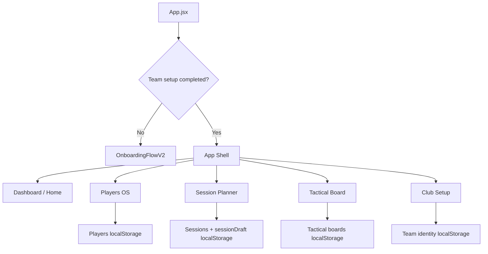

# Project Overview

Coach Command Centre is a React + Vite football coaching workspace. The current product is a local-first MVP that stores data in browser localStorage and is deployed through Vercel.

The app is not a placeholder shell. It already contains substantial working modules for team identity, players, sessions, tactical diagrams, and dashboard summaries.

## Tech Stack

| Area | Current setup |
| --- | --- |
| Frontend | React 19 |
| Build tool | Vite 7 |
| Styling | CSS files imported in `src/main.jsx` |
| Persistence | Browser localStorage via `src/utils/storage.js` |
| Theme | Team identity CSS variables via `src/utils/teamIdentity.js` |
| Deployment | Vercel default Vite flow |
| Backend | Not present |
| AI/API | Not present |

## Repository Structure

```text
football-coach-command-centre/
  README.md
  PROJECT_CONTEXT.md
  PRODUCT_BRIEF.md
  DEVELOPMENT_LOG.md
  CODEX_RULES.md
  ROADMAP.md
  package.json
  vite.config.js
  index.html
  src/
    App.jsx
    main.jsx
    components/
      DiagramEditor.jsx
      DiagramPreview.jsx
      TeamBadge.jsx
    pages/
      Dashboard.jsx
      OnboardingFlow.jsx
      OnboardingFlowV2.jsx
      Players.jsx
      PlayersOperatingSystem.jsx
      PlayersOperatingSystemV2.jsx
      SessionPlanner.jsx
      TacticalBoard.jsx
      TeamSetup.jsx
    utils/
      storage.js
      teamIdentity.js
    *.css
  docs/
    PROJECT_OVERVIEW.md
    MODULE_GUIDE.md
    DATA_AND_STORAGE.md
    UI_DESIGN_GUIDE.md
    DEVELOPMENT_TASKS.md
    ITERATION_PLAN.md
```

## Module Status

| Module | Status | Notes |
| --- | --- | --- |
| Dashboard / Home | Implemented | Live Coach HQ dashboard using real local data. |
| Onboarding | Implemented | First-run flow for coach, team, squad, season, and direction. |
| Club Setup | Implemented | Team identity and theme settings. |
| Players | Implemented | Player Centre, Squad Management, lineup, tactics, assignments, profiles, notes, avatars. |
| Session Planner | Implemented | Session Studio dashboard, workspace, draft autosave, activity editor, diagrams. |
| Tactical Board | Implemented | Saved boards, pitch layouts, draggable objects, drawing tools, inspector, presentation mode. |
| Match Centre | Future shell | Disabled future nav item and dashboard preview. |
| Calendar | Future shell | Disabled future nav item. |
| Reports | Future shell | Disabled future nav item. |

## App Flow



## Deployment Setup

There is no `vercel.json` in the repository. Deployment is expected to use Vercel's default Vite detection:

- install command: `npm install`
- build command: `npm run build`
- output directory: `dist`

## Current Limits

- Data is stored only in the current browser.
- There is no backend or cloud sync.
- There is no login or account model.
- AI assistant UI is a future shell only.
- Match Centre, Calendar, and Reports are not implemented yet.
